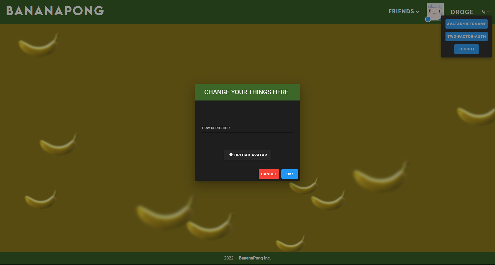

# BananaPong

Final project of the 42_cursus. (Version: 9)<br>

BananaPong is a onepage fullstack website where you can play pong with players among other things such as  JWT / 2fa authentification, a chat, private messages, friends list, profiles, a match-making system, a spectating system and modifications to the pong game such as different background and gamemodes.

BananaPong uses the following technologies:
- **VueJS**
- **NestJS**
- **PostgreSQL**

# Usage

**Before starting**, please replace the `FORTYTWO_ID`, `FORTYTWO_SECRET` and `AUTH_CALLBACK` variables in `docker/backend.env` with your own (from the 42 API).<br>
Then, run the following command:

```bash
docker-compose up --build
```
> We also provided shell scripts you can use `start.sh` to start the project and `clean.sh` with the arguemnts `all` (to remove all the downloaded files) or `bbd` (only delete the database).
If everything went well, you should be able to access the website at `http://localhost:8080`.
> if you'd like to modify additional settings, please feel free to do so in the others environment files.<br>
> Upon first launch, you will be asked to authenticate with your 42 account. If you don't have one, please uncomment the `@Get('generate/:id')` in `/backend/src/auth/auth.controller.ts` and then call that method with your desired id.

# API

Our API is fully documented with swagger at `http://localhost:3000/api/` (using openapi3.0).<br>
Thanks to @Amoenus for the Swagger Dark Theme.
> Make sure sure you input a correct JWT token in the Authorize menu. Your JWT token is the one you get after logging in with your 42 account. It's located in the LocalStorage of your browser under the name token.

# Database

We use pgadmin4 to manage our database, it's located at `http://localhost:5000/`.<br>
The email is `transcendence@42paris.fr` and the password is `transcendence` you may change them in the `docker/pgadmin.env` file.
> Once logging in, the database may send a lot of logs to the console. We tried disabling them, but it doesn't work everytime.

We used TypeORM for our database, it provides a lot of features such as migrations, relations, and most importantly, security.

# Docs

**NESTJS** documentation is available at `https://docs.nestjs.com/`.<br>
**VUEJS** (vuejs 2) documentation is available at `https://vuejs.org/v2/guide/`.<br>
**VUEX** documentation is available at `https://vuex.vuejs.org/`.<br>
**SWAGGER** (OAS 3.0) documentation is available at `https://swagger.io/specification/`. (I Heavily recommend the use of https://editor.swagger.io)<br>
**TYPEORM** documentation is available at `https://typeorm.io/`.<br>
# Screenshots





## MADE WITH LOVE BY :

- [hallainea](https://github.com/hallainea/) aka **ahallain**
- [Assxios](https://github.com/assxios/) aka **droge**
- [Nimon77](https://github.com/Nimon77/) aka **nsimon**
- [ademjemaa](https://github.com/ademjemaa/) aka **adjemaa**
- [mmaj0708](https://github.com/mmaj0708/) aka **mmaj**
